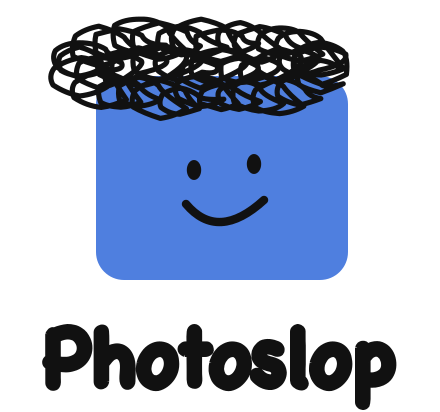
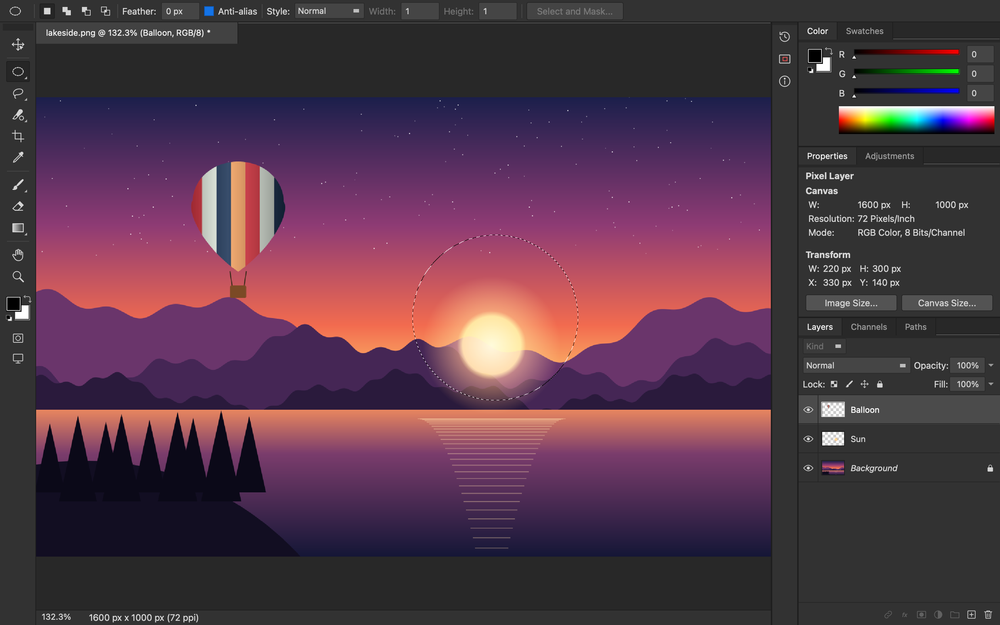
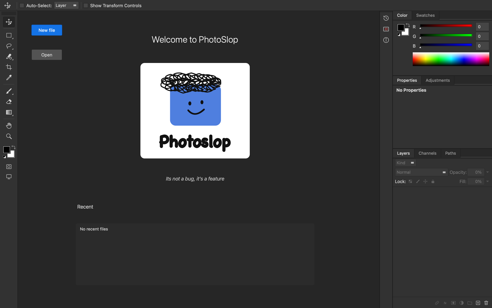
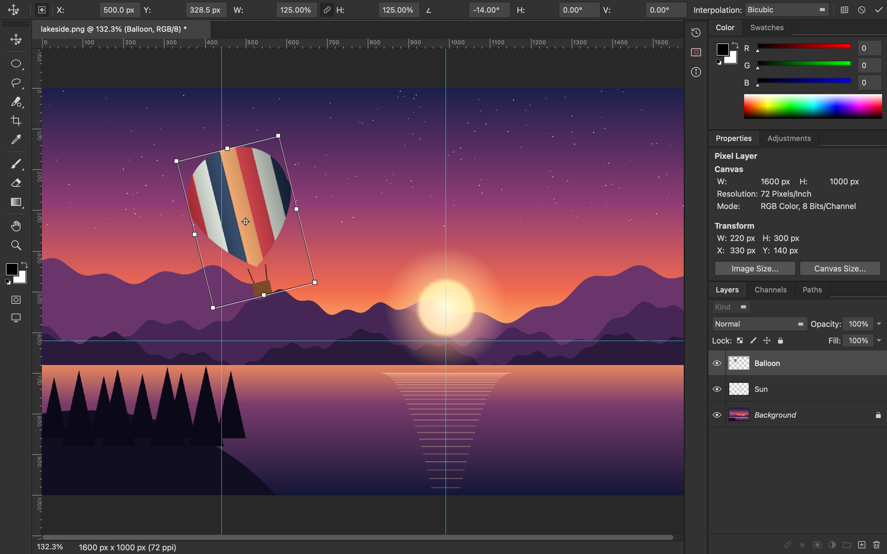
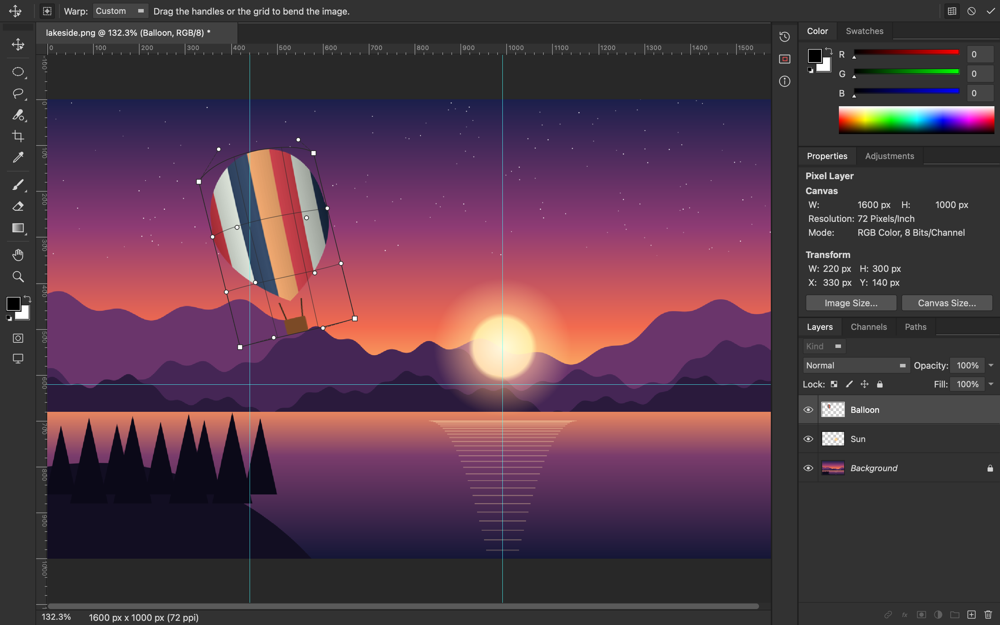
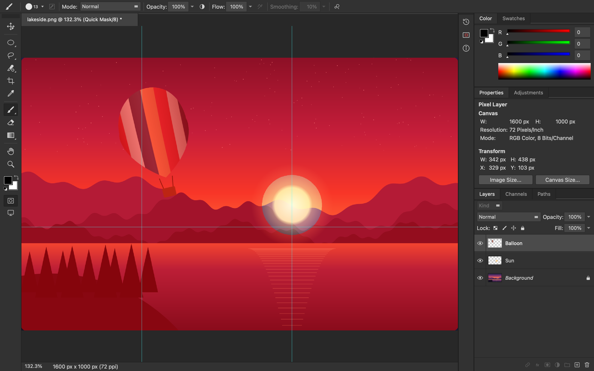
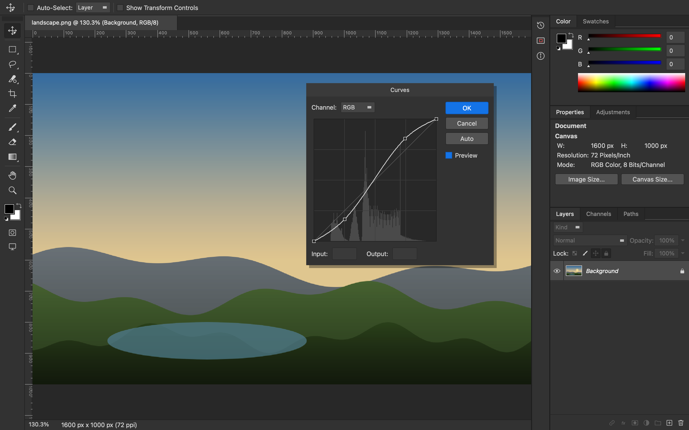
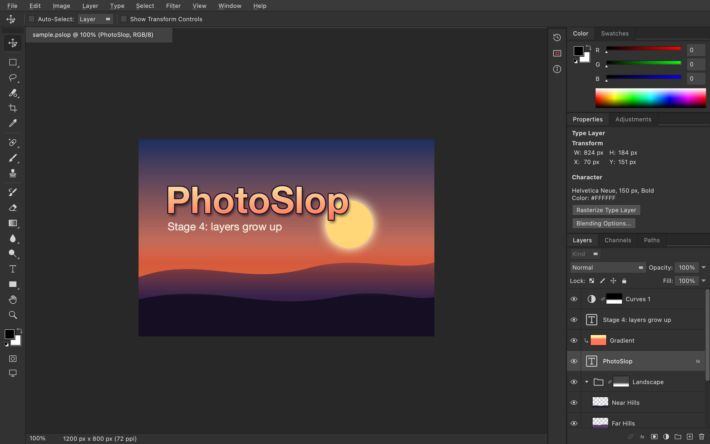
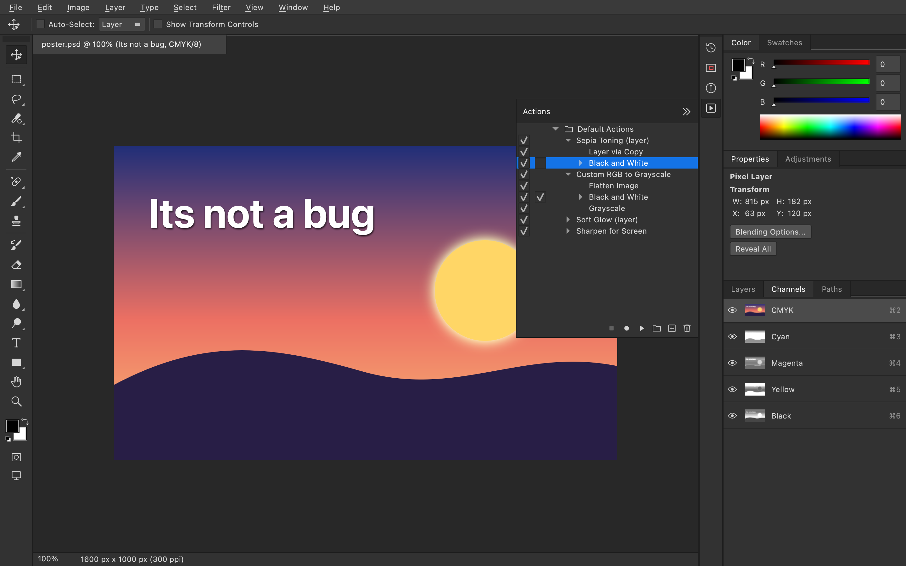

<p align="center">
  
</p>

<p align="center"><i>Its not a bug, it's a feature</i></p>

---

PhotoSlop is a cross-platform raster image editor for macOS, Linux and Windows. Its layout, behaviour and keyboard shortcuts are designed to feel familiar, so anyone who has used a traditional image editor can pick it up straight away.

It is written in C++20 with Qt 6 (Widgets). PhotoSlop is not affiliated with Adobe. All icons and artwork are original.



## Screenshots

| | |
|---|---|
|  |  |
| **Home screen** with New file, Open and recent files | **Free Transform**: rotate and scale a layer, with rulers, guides and exact values in the options bar |
|  |  |
| **Warp** bends a layer with a 4 × 4 control grid | **Quick Mask** shows the selection as a red overlay you can paint on |
|  |  |
| **Curves** with a histogram, previewing live on the canvas | **Layer power features**: a group with a mask, a gradient clipped to a type layer with a stroke and drop shadow, a glowing ellipse shape and a masked Curves adjustment layer |

|  | |
| **Pro features**: a layered Photoshop file in CMYK mode with its colour plates in the Channels panel, and the Actions panel with recorded steps | |

## Status: Stage 5 (pro and platform)

| Area | What works |
|---|---|
| Workspace | Photoshop "Essentials" layout: toolbar on the left, options bar on top, tabbed panel groups on the right, a collapsed icon strip (History, Navigator, Info), document tabs, a per-document status bar, a Home screen, Tab / Shift+Tab to hide panels, F to cycle screen modes |
| Documents | New (preset browser), Open, Open Recent, Save, Save As, Save a Copy, Revert, Export As, Quick Export as PNG, Close / Close All / Close Others, multiple documents, drag-and-drop to open |
| File formats | Native layered `.pslop` (groups, masks, adjustment, type and shape layers and styles included); layered Photoshop `.psd` to open and save, and `.psb` to open; PNG, JPEG, BMP, GIF, TIFF and WebP for import and flattened export |
| Photoshop files | PhotoSlop's own reader and writer. Opening reads Bitmap, Grayscale, Duotone (as grey), Indexed, RGB, CMYK and Lab files at 1, 8, 16 and 32 bits per channel, raw, RLE or ZIP compressed. Layers keep their names (Unicode), blend modes, opacity, fill, visibility, locks and clipping; groups (with Pass Through), layer masks, guides and resolution come through, and so do Levels, Curves, Hue/Saturation, Color Balance, Brightness/Contrast, Invert, Posterize and Threshold adjustment layers. Saving writes all of that in the document's colour mode, plus a full composite so other apps can show the file. A note after opening or saving lists anything that could not be kept |
| Image modes | Image ▸ Mode ▸ Grayscale, RGB Color, CMYK Color and Lab Color, undoable. Grayscale discards colour (after asking) and keeps the document grey: colours paint as their grey. The title bar shows the mode ("Layer 1, CMYK/8"), the Info panel reads values in the document's mode with CMYK alongside, and the Channels panel shows the mode's channels (Gray; Cyan, Magenta, Yellow, Black; Lightness, a, b). Grey PNG and TIFF files open in Grayscale mode |
| GPU canvas | With Preferences ▸ Performance ▸ Use Graphics Processor (on by default when OpenGL 2 is available), the canvas is drawn with OpenGL: the image lives in tiled textures and only the parts that change are uploaded again |
| Preferences | Edit ▸ Preferences (Ctrl+K): Home screen, Zoom with Scroll Wheel, UI font size, history states, Use Graphics Processor, painting and other cursors (Standard, Precise, Brush Tip, crosshair), transparency checkerboard size and colours, ruler units, guide and grid colours, grid style, gridline spacing and subdivisions, and the length of the recent file list |
| Keyboard shortcuts | Edit ▸ Keyboard Shortcuts (Ctrl+Alt+Shift+K) changes the shortcut of any menu command or tool, with search, Add and Delete Shortcut, Use Default and Reset All. Taking a key that another command uses moves it, and the dialog says from where. Summarize saves the list as a web page. Changes are kept between sessions |
| Workspaces | Window ▸ Workspace ▸ New Workspace saves the panel layout under a name; pick a workspace to switch to it, Reset to go back to how it was saved, Delete Workspace to remove it. Essentials is always there |
| Actions | Window ▸ Actions (Alt+F9) records menu commands into named actions in sets, and plays them back on any document. Filter and adjustment dialogs made of sliders record their settings and replay without the dialog; each step can be switched off, or set to stop at its dialog. Double-click a step to play from there. Default Actions include Sepia Toning, Custom RGB to Grayscale, Soft Glow and Sharpen for Screen. Actions are kept between sessions |
| Layers | New, duplicate, delete, rename (double-click the name), drag to reorder, visibility (Alt-click to solo), opacity, fill, 27 blend modes, four lock types, Background layer rules, Layer via Copy/Cut, Merge Down, Merge Visible, Flatten, Ctrl/Cmd-click a thumbnail to load its transparency as a selection |
| Groups | New Group, Group Layers (Ctrl+G), Ungroup (Ctrl+Shift+G), nesting, disclosure triangles, Pass Through or any blend mode, group opacity and masks, drag layers into and out of groups, Bring Forward / Send Backward step in and out of groups, Merge Group (Ctrl+E on a group), duplicate and delete whole groups |
| Masks | Layer ▸ Layer Mask: Reveal All, Hide All, Reveal Selection, Hide Selection, Delete, Apply, Disable/Enable, Link/Unlink, Load Selection. Click the mask thumbnail to paint on the mask (every painting tool, Fill, filter and adjustment works on it; colours paint as grey), click the layer thumbnail to go back; Shift-click disables, Ctrl/Cmd-click loads it as a selection. Linked masks move with the layer |
| Clipping masks | Create/Release Clipping Mask (Ctrl+Alt+G): a layer shows only inside the pixels of the layer below; several layers can clip to one base, and hiding the base hides them |
| Adjustment layers | Layer ▸ New Adjustment Layer and the Adjustments panel: Brightness/Contrast, Levels, Curves, Hue/Saturation, Color Balance, Black & White, Invert, Posterize, Threshold. They change everything below without touching pixels, using the same dialogs as Image ▸ Adjustments (Layer Content Options or a double-click on the thumbnail reopens them). Each has a mask, made from the selection if there is one. Inside a group they only affect the group unless it is Pass Through |
| Layer styles | Layer ▸ Layer Style (or double-click a row, or the fx button): Blending Options, Stroke (outside, inside, centre), Color Overlay, Outer Glow, Drop Shadow, with a live preview. Copy, Paste and Clear Layer Style, Hide All Effects, Rasterize ▸ Layer Style. Effects ignore Fill opacity, as in Photoshop |
| Type | Horizontal Type Tool (T): click to type, click a type layer to edit it. Font, style, size, anti-aliasing, alignment and colour in the options bar; Enter makes a new line, Ctrl+Enter or Enter on the keypad commits, Esc cancels; arrow keys, Home/End and Backspace/Delete edit. The options restyle a selected type layer. Type stays editable through moves, Free Transform, canvas rotation and Image Size; painting on it asks to rasterize it first |
| Shapes | Rectangle (with corner radius), Ellipse, Polygon (sides, star) and Line (weight) tools (U) draw shape layers; Shift constrains, Alt draws from the centre. Fill and stroke colours (Shift-click a swatch for none) and stroke width restyle the selected shape. Free Transform keeps shapes crisp |
| Tools | Move (moves groups, linked masks and type; Auto-Select by layer or group), Rectangular and Elliptical Marquee, Lasso, Polygonal Lasso and Magnetic Lasso, Quick Selection, Magic Wand, Crop, Eyedropper, Spot Healing Brush, Healing Brush, Brush, Pencil, Clone Stamp, History Brush, Eraser, Gradient (5 types), Paint Bucket, Blur, Sharpen, Smudge, Dodge, Burn, Sponge, Type, Rectangle, Ellipse, Polygon, Line, Hand, Zoom |
| Retouching | Clone Stamp (S) and Healing Brush (J): Alt-click a source point, then paint; Aligned, and Sample Current Layer, Current & Below or All Layers. The Healing Brush blends the copy into its surroundings. Spot Healing Brush (J) replaces what you paint with nearby texture (Proximity Match). History Brush (Y) paints back the document as opened, or any history state picked with "Set Source for History Brush" in the History panel. Dodge and Burn (O) with Shadows / Midtones / Highlights and Exposure, Sponge to saturate or desaturate, Blur, Sharpen and Smudge with Strength |
| Painting | Size, hardness, opacity, flow, blend mode, pen pressure for size and opacity, Shift-click straight lines, brush preset picker. Opacity caps each stroke the same way it does in Photoshop |
| Selections | Feathered 8-bit masks; add, subtract and intersect (Shift / Alt / Shift+Alt); marching ants; All, Deselect, Reselect, Inverse; Modify ▸ Border, Smooth, Expand, Contract, Feather; Grow and Similar (using the Magic Wand tolerance); Transform Selection; drag inside a selection to move its outline; arrow keys to nudge |
| Selection tools | Magic Wand (tolerance, sample size, contiguous, sample all layers); Quick Selection (paint to grow the selection into similar, edge-bounded areas; switches to Add after the first stroke); Magnetic Lasso (follows the strongest edge within Width; Contrast and Frequency options; Backspace removes the last anchor, double-click or Enter closes) |
| Quick Mask | Q toggles it. The selection becomes a red-tinted mask that every painting tool, Fill, Clear and Invert can edit; leaving Quick Mask turns it back into a selection. Entering and leaving are history states |
| Transform | Free Transform and Edit ▸ Transform (Scale, Rotate, Skew, Distort, Perspective, Warp, Rotate 180°/90°, Flip, Again). Corner handles scale proportionally (Shift for free scaling, Alt from the reference point), drag outside to rotate (Shift for 15° steps), Ctrl/Cmd-drag a corner to distort or an edge to skew, Ctrl+Alt+Shift-drag a corner for perspective. The options bar takes exact X/Y, W/H, angle and skew values and the interpolation. Warp bends the layer with a 4 × 4 control grid: drag the points or the surface. Enter commits, Esc or Undo cancels |
| Rulers, guides, grid | Rulers (pixels, inches, cm, mm or percent; right-click to change). Drag a guide out of a ruler (Alt flips its direction), move guides with the Move tool and drag them off the window to delete; New Guide, Clear Guides, Lock Guides; guides are saved in `.pslop` files and undoable. Grid every inch with four subdivisions. Extras (Ctrl+H) hides them all |
| Snapping | Snap (Ctrl+Shift+;) to guides, the grid and document bounds while drawing marquees, cropping, moving layers and selections, and transforming |
| Edit | History panel (50 states), Undo/Redo, Toggle Last State, Cut/Copy/Copy Merged/Paste/Paste in Place, Fill dialog, Clear |
| Image | Image Size, Canvas Size (with anchor), rotate 90°/180°, flip canvas, Crop to selection, Duplicate |
| Adjustments | Levels (per channel, with histogram, draggable input and output sliders, Auto), Curves (per channel, click to add points, drag off the graph or press Delete to remove, Auto), Hue/Saturation (Master plus six colour ranges, Colorize), Color Balance (shadows, midtones and highlights, Preserve Luminosity), Brightness/Contrast (with Use Legacy), Black & White (six colour sliders, Tint), Threshold, Posterize, Invert, Desaturate. Image ▸ Auto Tone, Auto Contrast and Auto Color. Hold Alt (Option) when opening Levels, Curves, Hue/Saturation or Color Balance to start from the last settings |
| Filters | Blur, Blur More, Box Blur, Gaussian Blur, Motion Blur; Add Noise (uniform or gaussian, monochromatic), Median; Mosaic; Sharpen, Sharpen More, Unsharp Mask; High Pass. Filter dialogs remember their settings. Filter ▸ Last Filter repeats the last one with the same settings |
| Live preview | Adjustment and filter dialogs preview on the canvas as you drag, computed on all CPU cores in the background; the Preview box compares before and after. Everything works inside the selection (feathered edges blend), honours Lock Transparency, and also edits the Quick Mask. Blurs can spread into transparent areas |
| Fade | Edit ▸ Fade (Ctrl+Shift+F), right after a filter or adjustment, mixes it back with opacity and a blend mode |
| Colour | Foreground/background colours, Photoshop-style Color Picker (HSB / RGB / CMYK / hex), Color panel, Swatches panel |
| Properties panel | Shows what is selected: canvas size, a layer's position, an adjustment layer's settings button, a type layer's font, a shape's fill and stroke, or the mask controls when a mask is targeted |
| Compositing | Groups, clipping, masks, adjustment layers and effects are composited in bands on all CPU cores |

Menu items for features PhotoSlop does not have yet are in the menus, greyed out, with their Photoshop shortcuts shown.

What differs from Photoshop so far: Quick Selection uses colour similarity and edge strength rather than a trained model; Warp offers the custom grid only (no Arc, Bulge and other presets); Transform ▸ Again repeats the last transform's matrix rather than its parameters; Snap To ▸ Layers and Slices are not implemented yet. Adjustment dialogs have no saved presets, and filter dialogs preview on the canvas only (no thumbnail inside the dialog). The colour maths follow Photoshop's behaviour closely but are not pixel-identical.

Stage 4 limits: the Layers panel selects one layer at a time, so Group Layers groups the selected layer (drag others in afterwards). Type is point text only, with one font, size and colour per layer (no paragraph text, per-character styles, tracking or leading controls), and sizes are in pixels. Shapes are drawn once and restyled from the options bar; their outlines cannot be edited point by point (there is no Pen or Path Selection tool yet). Layer styles cover Stroke, Color Overlay, Outer Glow and Drop Shadow, and cannot be applied to groups. Spot Healing uses Proximity Match only (no Content-Aware). Fill layers, vector masks, smart objects and linked layers are not implemented.

Stage 5 limits: PhotoSlop edits at 8 bits per channel. 16- and 32-bit Photoshop files open (converted to 8 bits, with a note), but Image ▸ Mode ▸ 16 and 32 Bits/Channel are not available yet. Pixels are always stored as RGB: CMYK uses a plain device conversion without colour profiles, so CMYK documents look the same as RGB and the separations are not ready for a printing press; Lab is converted exactly, but 8-bit Lab rounds the most saturated colours. In Photoshop files, type and shape layers are saved as pixels, layer styles are merged into their layers, and Black & White adjustment layers are left out (Photoshop stores them in a format PhotoSlop does not write). On the way in, type layers, smart objects and fill layers open as pixels, and layer styles and the other adjustment types are not imported. Actions record menu commands only, not tool strokes, and dialogs other than the slider-based filters and adjustments (Levels, Curves, Fill, Image Size...) open again when played.

## Keyboard shortcuts

The shortcuts match Photoshop on every platform. Wherever Windows and Linux use **Ctrl** and **Alt**, macOS uses **⌘ Cmd** and **⌥ Option**. Edit ▸ Keyboard Shortcuts (Ctrl+Alt+Shift+K) lists them all inside the app and lets you change them.

| Action | Windows / Linux | macOS |
|---|---|---|
| New / Open / Save / Save As | Ctrl+N / Ctrl+O / Ctrl+S / Ctrl+Shift+S | ⌘N / ⌘O / ⌘S / ⇧⌘S |
| Export As | Ctrl+Alt+Shift+W | ⌥⇧⌘W |
| Undo / Redo / Toggle Last State | Ctrl+Z / Ctrl+Shift+Z / Ctrl+Alt+Z | ⌘Z / ⇧⌘Z / ⌥⌘Z |
| Copy Merged / Paste in Place | Ctrl+Shift+C / Ctrl+Shift+V | ⇧⌘C / ⇧⌘V |
| Fill / Fill with FG / Fill with BG | Shift+F5 / Alt+Backspace / Ctrl+Backspace | ⇧F5 / ⌥⌫ / ⌘⌫ |
| Select All / Deselect / Reselect / Inverse | Ctrl+A / Ctrl+D / Ctrl+Shift+D / Ctrl+Shift+I | ⌘A / ⌘D / ⇧⌘D / ⇧⌘I |
| New Layer / Layer via Copy / via Cut | Ctrl+Shift+N / Ctrl+J / Ctrl+Shift+J | ⇧⌘N / ⌘J / ⇧⌘J |
| Merge Down (Merge Group) / Merge Visible | Ctrl+E / Ctrl+Shift+E | ⌘E / ⇧⌘E |
| Group / Ungroup | Ctrl+G / Ctrl+Shift+G | ⌘G / ⇧⌘G |
| Create / Release Clipping Mask | Ctrl+Alt+G | ⌥⌘G |
| Bring Forward / Send Backward | Ctrl+] / Ctrl+[ | ⌘] / ⌘[ |
| Image Size / Canvas Size | Ctrl+Alt+I / Ctrl+Alt+C | ⌥⌘I / ⌥⌘C |
| Free Transform / Transform Again | Ctrl+T / Ctrl+Shift+T | ⌘T / ⇧⌘T |
| Quick Mask | Q | Q |
| Feather | Shift+F6 | ⇧F6 |
| Rulers / Grid / Guides | Ctrl+R / Ctrl+' / Ctrl+; | ⌘R / ⌘' / ⌘; |
| Snap / Lock Guides / Extras | Ctrl+Shift+; / Ctrl+Alt+; / Ctrl+H | ⇧⌘; / ⌥⌘; / ⌘H |
| Levels / Curves / Hue/Saturation / Color Balance | Ctrl+L / Ctrl+M / Ctrl+U / Ctrl+B (add Alt for the last settings) | ⌘L / ⌘M / ⌘U / ⌘B (add ⌥ for the last settings) |
| Black & White | Ctrl+Alt+Shift+B | ⌥⇧⌘B |
| Invert / Desaturate | Ctrl+I / Ctrl+Shift+U | ⌘I / ⇧⌘U |
| Auto Tone / Auto Contrast / Auto Color | Ctrl+Shift+L / Ctrl+Alt+Shift+L / Ctrl+Shift+B | ⇧⌘L / ⌥⇧⌘L / ⇧⌘B |
| Last Filter / Fade | Ctrl+Alt+F / Ctrl+Shift+F | ⌥⌘F / ⇧⌘F |
| Zoom In / Out / Fit / 100% | Ctrl+= / Ctrl+- / Ctrl+0 / Ctrl+1 | ⌘= / ⌘- / ⌘0 / ⌘1 |
| Tools | V M L W C I J B S Y E G O T U H Z (Shift+letter cycles a tool group) | same |
| Clone / Healing source | Alt-click | ⌥-click |
| Type: new line / commit / cancel | Enter / Ctrl+Enter or keypad Enter / Esc | Return / ⌘Return or keypad Enter / Esc |
| Default colours / Swap colours | D / X | same |
| Brush size / hardness | [ ] / Shift+[ Shift+] | same |
| Tool or layer opacity | 1…9, 0 = 100%, type two digits fast for e.g. 45% | same |
| Temporary Hand / Eyedropper / Move | hold Space / Alt / Ctrl | hold Space / ⌥ / ⌘ |
| Hide panels / hide right panels | Tab / Shift+Tab | same |
| Preferences / Keyboard Shortcuts | Ctrl+K / Ctrl+Alt+Shift+K | ⌘K (in the PhotoSlop menu) / ⌥⇧⌘K |
| Panels | F6 Color, F7 Layers, F8 Info, Alt+F9 Actions | F6, F7, F8, ⌥F9 |

## Download

Ready-to-run builds for each platform are on the GitHub **Releases** page:

| Platform | File | How to run it |
|---|---|---|
| macOS (Apple silicon and Intel) | `PhotoSlop-<version>-macos.dmg` | Open the disk image and drag PhotoSlop to Applications. The app is not signed yet, so the first time, right-click it and choose Open |
| Windows (64-bit) | `PhotoSlop-<version>-windows-x64-setup.exe` | Run the installer. It adds a Start menu entry, opens `.pslop` files and can add PhotoSlop to "Open with" for `.psd` files |
| Windows (64-bit, portable) | `PhotoSlop-<version>-windows-x64.zip` | Unzip it and run `PhotoSlop.exe` |
| Debian and Ubuntu (x86-64) | `photoslop_<version>_amd64.deb` | `sudo apt install ./photoslop_<version>_amd64.deb`, then start PhotoSlop from the applications menu or run `photoslop` |
| Linux (x86-64) | `PhotoSlop-<version>-linux-x86_64.AppImage` | `chmod +x` the file, then run it |

The version history is in [CHANGELOG.md](CHANGELOG.md).

## Building

You need CMake 3.21+, Ninja (optional) and Qt 6.5 or newer with the Widgets and Svg modules.

**macOS**
```sh
brew install qt cmake ninja
cmake -S . -B build -G Ninja -DCMAKE_PREFIX_PATH=$(brew --prefix qt)
cmake --build build
open build/PhotoSlop.app
```

**Ubuntu**
```sh
sudo apt install qt6-base-dev qt6-svg-dev libgl1-mesa-dev cmake ninja-build
cmake -S . -B build -G Ninja
cmake --build build
./build/PhotoSlop
```

**Windows** (from a "Developer Command Prompt for VS", with Qt from the Qt online installer)
```bat
cmake -S . -B build -G Ninja -DCMAKE_PREFIX_PATH=C:\Qt\6.8.0\msvc2022_64
cmake --build build
build\PhotoSlop.exe
```

### Tests
```sh
ctest --test-dir build --output-on-failure
```
`test_core` covers blend maths, undo/redo, selections and Select ▸ Modify, transform and warp resampling, Quick Mask, guides, merging, crop/rotate, file round-trips, every adjustment and filter (including selection, lock and cancel handling), groups, masks, clipping, adjustment layers, layer styles, type and shape layers, healing, parallel compositing, Photoshop file round trips (layers, groups, masks, clipping, adjustment layers, guides, each colour mode) and the colour mode conversions. `test_ui` drives the real main window with simulated mouse and keyboard input to check every tool (including typing), Free Transform, Quick Mask, rulers, guides, snapping, the live-preview dialogs, Last Filter, Fade, the Layer Style dialog, adjustment layers, Layers panel clicks and drops, Image ▸ Mode, saving and reopening Photoshop files, Preferences, the Keyboard Shortcuts editor, workspaces and recording and playing actions. On a headless machine, run it with `QT_QPA_PLATFORM=offscreen`.

### Versions and releases

The version number lives in the `VERSION` file; CMake reads it and the app shows it in the splash screen and About box. To make a release:

1. Add notes under `## [Unreleased]` in [CHANGELOG.md](CHANGELOG.md) and commit them.
2. Run `scripts/bump-version.sh minor` (or `patch`, `major`, or an exact `X.Y.Z`). It updates `VERSION`, dates the changelog section, commits, and tags the commit `vX.Y.Z`.
3. Run `git push --follow-tags`. The tag starts the Release workflow, which builds and tests on all three platforms and publishes a GitHub release with the downloads and the changelog notes.

## Project layout

```
src/core/     Document model: layers and the layer tree, blend modes, the compositor (groups, masks, clipping, adjustment layers, effects), type and shape layers, selections, transforms and warps, adjustments, filters, healing, undo commands, document operations
src/io/       File loading and saving (.pslop, Photoshop .psd/.psb and flat image formats)
src/tools/    One class per tool, plus the ToolManager (groups, shortcuts, temporary tools)
src/ui/       Main window, canvas view, rulers, view options, toolbox, panels and dialogs
resources/    Original SVG icons and the logo
docs/         README screenshots
packaging/    App icons, the macOS Info.plist, the Windows installer script and the Linux desktop entry, MIME type and .deb builder
scripts/      bump-version.sh
tests/        Core unit tests and GUI tests
```

## Roadmap

1. **Core editor**: done.
2. **Selections and transforms**: done.
3. **Adjustments and filters**: done.
4. **Layer power features**: done.
5. **Pro and platform**: done (this release), except editing at 16 and 32 bits per channel.

## License

Copyright (C) 2026 gibigbig

PhotoSlop is free software: you can redistribute it and/or modify it under the terms of the GNU General Public License as published by the Free Software Foundation, either version 3 of the License, or (at your option) any later version. It is distributed in the hope that it will be useful, but WITHOUT ANY WARRANTY; without even the implied warranty of MERCHANTABILITY or FITNESS FOR A PARTICULAR PURPOSE. See [LICENSE](LICENSE) for the full text.
